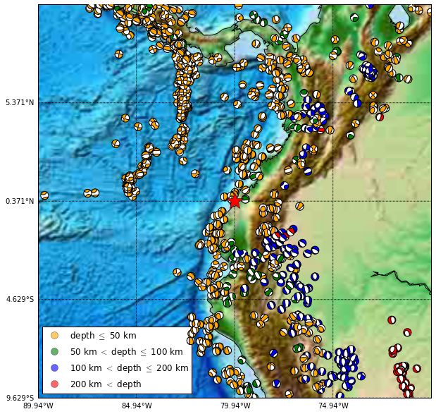

I created this script for our earthquake of this week (There are some other scripts for different purposes, I may add them sometime later, but you can find them at my [Github](https://github.com/qingkaikong/Learning_Obspy/tree/master/04_catalogAnalysis_20140421)). The purpose of this script is that, a lot of times, when we look at an earthquake occured recently, we want to see the historical moment tensors in this region. These historical moment tensors can tell us a lot of things, i.e. tectonic setting, fault information, etc. Then using this script, all you need do is to specify the starttime, endtime, and region (for region, right now, I just use one recent earthquake location as the center, and expand them both in latitude and longitude a certain degree). 

For example, the [2016 M7.8 Ecuador](http://earthquake.usgs.gov/earthquakes/eventpage/us20005j32#general), if we want to see the historical moment tensors in this region, we can do as the followings. You can find the script on Qingkai's Github. 


```python
import warnings
warnings.filterwarnings('ignore')
from obspy import UTCDateTime
import urllib
import urllib2
import numpy as np
from collections import OrderedDict
import matplotlib.pyplot as plt
from mpl_toolkits.basemap import Basemap
from obspy.imaging.beachball import beach
from matplotlib.lines import Line2D
from BeautifulSoup import BeautifulSoup
%pylab inline
```

    Populating the interactive namespace from numpy and matplotlib


```python
def get_hist_mt(t1, t2, llat = '-90', ulat = '90', llon = '-180', ulon = '180', 
    lmw = 0, umw = 10, evla = None, evlo = None, step = 2.0, list_ = '6'):
    '''
    Function to query the GCMT and save the data for ploting. If evla and 
    evlo are provided, it will use this location as the center and adding 
    step to both latitude and longitude for the box. 
    
    t1 - starttime, example: UTCDateTime("1979-01-01")
    t2 - endtime, example: UTCDateTime("2016-01-01")
    llat - lower latitude
    ulat - upper latitude
    llon - left longitude
    ulon - right longitude
    lmw - the minimum magnitude to search
    umw - the maximum magnitude to search
    evla - latitude of the current earthquake
    evlo - longitude of the current earthquake
    step - from current earthquake location, expand lat/lon for a box
    list_ - format of data you want to return from the GCMT
    '''
    
    yr = t1.year
    mo = t1.month
    day = t1.day
    oyr = t2.year
    omo = t2.month
    oday = t2.day
    mat = {}
    locs = locals()  
    
    base_url = 'http://www.globalcmt.org/cgi-bin/globalcmt-cgi-bin/CMT4/form'
    
    #note here, we must use the ordered Dictionary, so that the order in the 
    #url is exactly the same order
    param = OrderedDict()
    param['itype'] = 'ymd'
    param['yr'] = yr
    param['mo'] = mo
    param['day'] = day
    param['otype'] = 'ymd'
    param['oyr'] = oyr
    param['omo'] = omo
    param['oday'] = oday
    param['jyr'] = '1976'
    param['jday'] = '1'
    param['ojyr'] = '1976'
    param['ojday'] = '1'
    
    param['nday'] = '1'
    param['lmw'] = str(lmw)
    param['umw'] = str(umw)
    param['lms'] = '0'
    param['ums'] = '10'
    param['lmb'] = '0'
    param['umb'] = '10'
    
    # now specify the region box
    if evla and evlo is not None:
        llat = evla - step
        ulat = evla + step
        llon = evlo - step
        ulon = evlo + step
    
    # save parameter for query
    param['llat'] = llat
    param['ulat'] = ulat
    param['llon'] = llon
    param['ulon'] = ulon
    
    param['lhd'] = '0'
    param['uhd'] = '1000'
    param['lts'] = '-9999'
    param['uts'] = '9999'
    param['lpe1'] = '0'
    param['upe1'] = '90'
    param['lpe2'] = '0'
    param['upe2'] = '90'
    param['list'] = list_
    
    # build the URL
    url = "?".join((base_url, urllib.urlencode(param)))
    print url
    
    # grab data and parse it
    page = urllib2.urlopen(url)
    parsed_html = BeautifulSoup(page)
    mecs_str = parsed_html.findAll('pre')[1].text.split('\n')

    # string to array
    def convertString(mecs_str):
        return map(float, mecs_str.split()[:9])
        
    psmeca = np.array(map(convertString, mecs_str))
    
    # save the results for plotting
    mat['psmeca'] = psmeca
    mat['url'] = url
    mat['range'] = (llat, ulat, llon, ulon)
    mat['evloc'] = (evla, evlo)
    return mat
    
def plot_hist_mt(psmeca_dict, figsize = (16,24), mt_size = 10, \
                 pretty = False, resolution='l'):
    '''
    Plot the historical moment tensor from the query of GCMT
    
    psmeca_dict - dictionary that returned from get_hist_mt function
    figsize - tuple of the size of the figure
    mt_size - size of the moment tensor on the plot
    pretty - boolean, whether want to plot nice maps
    resolution - low or high as you want
    '''
    
    if psmeca_dict['psmeca'] != []:
        psmeca = psmeca_dict['psmeca']
        #get the latitudes, longitudes, and the 6 independent component
        lats = psmeca[:,1]
        lons = psmeca[:,0]
        focmecs = psmeca[:,3:9]
        depths =  psmeca[:,2]    
        (llat, ulat, llon, ulon) = psmeca_dict['range'] 
        evla = psmeca_dict['evloc'][0]
        evlo = psmeca_dict['evloc'][1]

        plt.figure(figsize=figsize)
        m = Basemap(projection='cyl', lon_0=142.36929, lat_0=38.3215, 
            llcrnrlon=llon,llcrnrlat=llat,urcrnrlon=ulon,urcrnrlat=ulat,\
                    resolution=resolution)
    
        m.drawcoastlines()
        m.drawmapboundary()
    
        if pretty:    
            m.etopo()
        else:
            m.fillcontinents()
    
        llat = float(llat)
        ulat = float(ulat)
        llon = float(llon)
        ulon = float(ulon)
    
        m.drawparallels(np.arange(llat, ulat, (ulat - llat) / 4.0), \
                        labels=[1,0,0,0])
        m.drawmeridians(np.arange(llon, ulon, (ulon - llon) / 4.0), \
                        labels=[0,0,0,1])   
    
        ax = plt.gca()
        x, y = m(lons, lats)
    
        for i in range(len(focmecs)):
        
            if depths[i] <= 50:
                color = '#FFA500'
                #label_
            elif depths[i] > 50 and depths [i] <= 100:
                color = 'g'
            elif depths[i] > 100 and depths [i] <= 200:
                color = 'b'
            else:
                color = 'r'
        
            index = np.where(focmecs[i] == 0)[0]
        
            #note here, if the mrr is zero, then you will have an error
            #so, change this to a very small number 
            if focmecs[i][0] == 0:
                focmecs[i][0] = 0.001
        
            try:
                b = beach(focmecs[i], xy=(x[i], y[i]),width=mt_size, \
                          linewidth=1, facecolor=color)
            except:
                pass
            
            b.set_zorder(10)
            ax.add_collection(b)
        
        # add the current earthquake
        x_0, y_0 = m(evlo, evla)
        m.plot(x_0, y_0, 'r*', markersize=25, zorder = 10) 
        
        # add the legend
        circ1 = Line2D([0], [0], linestyle="none", \
                marker="o", alpha=0.6, markersize=10, markerfacecolor="#FFA500")
        circ2 = Line2D([0], [0], linestyle="none", \
                marker="o", alpha=0.6, markersize=10, markerfacecolor="g")
        circ3 = Line2D([0], [0], linestyle="none", \
                marker="o", alpha=0.6, markersize=10, markerfacecolor="b")
        circ4 = Line2D([0], [0], linestyle="none", \
                marker="o", alpha=0.6, markersize=10, markerfacecolor="r")
        plt.legend((circ1, circ2, circ3, circ4), \
                   ("depth $\leq$ 50 km", "50 km $<$ depth $\leq$ 100 km", \
                    "100 km $<$ depth $\leq$ 200 km", "200 km $<$ depth"), \
                   numpoints=1, loc=3)
        plt.show()
    else:
        print 'No historical MT found!'
```


```python
t1 = UTCDateTime("1979-01-01")
t2 = UTCDateTime("2016-01-01")

psmeca = get_hist_mt(t1, t2, evla = 0.371, evlo= -79.940, step = 10, lmw = 0)
plot_hist_mt(psmeca, figsize = (12, 10),  mt_size = 0.4, pretty = True, resolution='l')
```

    http://www.globalcmt.org/cgi-bin/globalcmt-cgi-bin/CMT4/form?itype=ymd&yr=1979&mo=1&day=1&otype=ymd&oyr=2016&omo=1&oday=1&jyr=1976&jday=1&ojyr=1976&ojday=1&nday=1&lmw=0&umw=10&lms=0&ums=10&lmb=0&umb=10&llat=-9.629&ulat=10.371&llon=-89.94&ulon=-69.94&lhd=0&uhd=1000&lts=-9999&uts=9999&lpe1=0&upe1=90&lpe2=0&upe2=90&list=6




