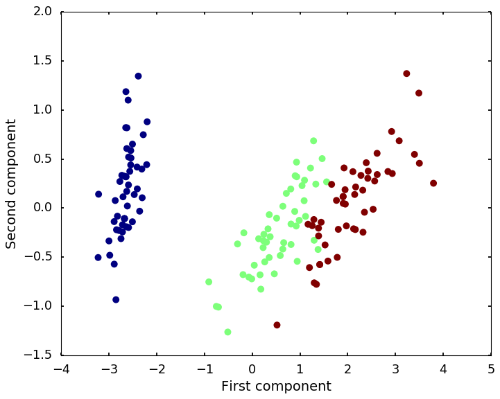
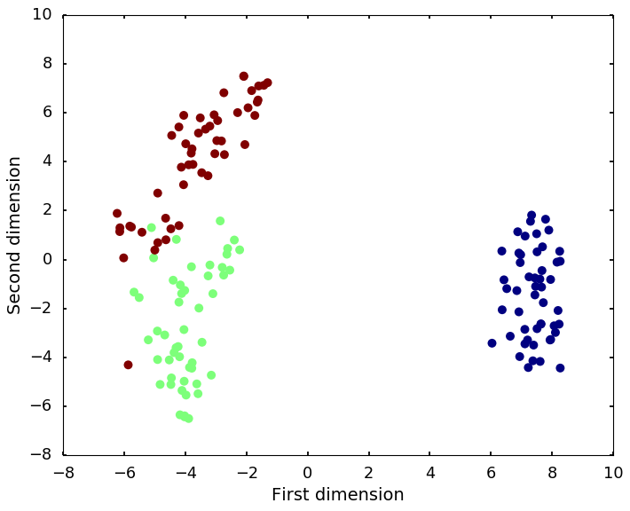
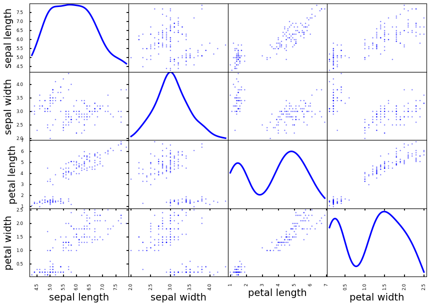
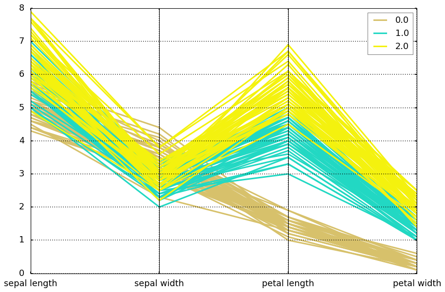
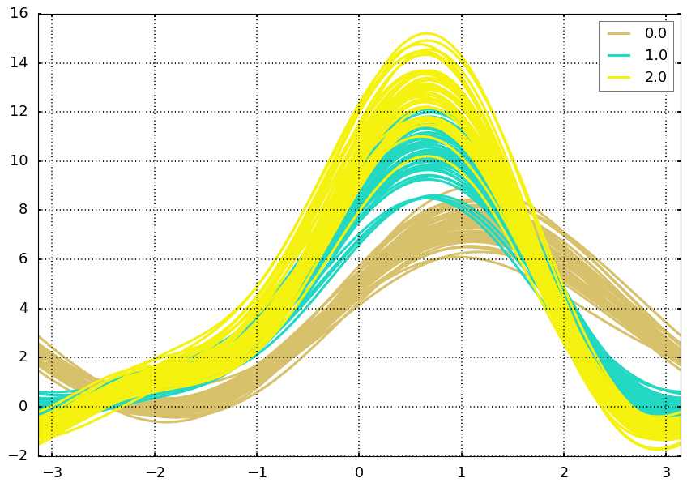
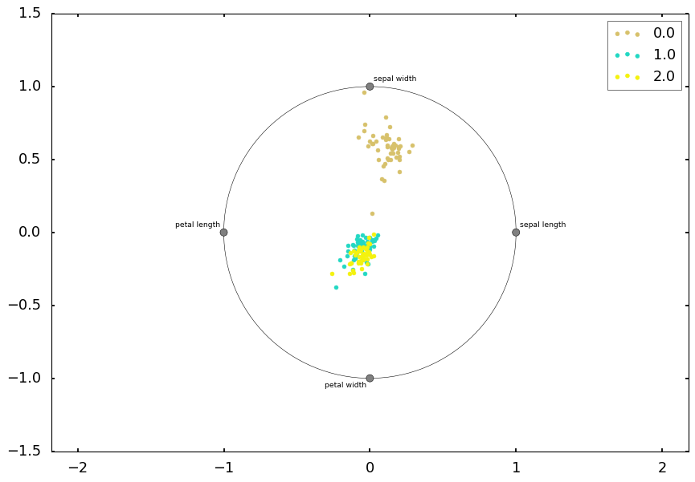

When we are dealing with machine learning datasets, many times, we have higher dimensional data than just the easy 2 dimensions. This makes us difficult to visualize the data to get a sense how different dimensions have a relationship with each other, or is there a hidden structure inside it. Today, I will show you the ways I usually use to visualize the higher dimensional datasets. You can find all the script at [Qingkai's Github](https://github.com/qingkaikong/blog/tree/master/2017_13_visualize_high_dimensional_dataset).  

I summarize ways to visualize high dimensional data into 2 groups:

1. Using algorithms to reduce dimension
2. Clever way to plot

Let's first see how to use algorithms to visualize the data. In this blog, we will use the [IRIS dataset](https://en.wikipedia.org/wiki/Iris_flower_data_set) to show how different methods work. 

### Let's first load data


```python
from sklearn import datasets
```


```python
# import the IRIS data
iris = datasets.load_iris()
iris_data = iris.data
Y = iris.target

print('There are %d features'%(iris_data.shape[1]))
print('There are %d classes'%(len(set(Y))))
```

    There are 4 features
    There are 3 classes


## 1 Reduce dimension using algorithms
### 1.1 Visualize high dimensional data with PCA

Principal Component Analysis is the classical way to reduce the dimensions. In our case, we have 4 features, which means we have 4 dimensions, difficult to visualize. With PCA, we can plot the first two components, and get a sense of the patterns hidden behind the data. 


```python
from sklearn.decomposition import PCA
import matplotlib.pyplot as plt
%matplotlib inline

plt.style.use('seaborn-poster')
```


```python
# Let's do a simple PCA and plot the first two components
pca = PCA(n_components=2)
X_pca = pca.fit_transform(iris_data)

# plot the first two components
plt.figure(figsize = (10, 8))
plt.scatter(X_pca[:, 0], X_pca[:,1], c = Y, s = 80, linewidths=0)
plt.xlabel('First component')
plt.ylabel('Second component')
```


    <matplotlib.text.Text at 0x111681e10>





The above figure is showing the first two components of the PCA. I colored the dots with the 3 classes so that we can see the hidden structures. 

### 1.2 Visualize high dimensional data with t-SNE

[t-distributed stochastic neighbor embedding (t-SNE)](https://en.wikipedia.org/wiki/T-distributed_stochastic_neighbor_embedding) is a nonlinear dimensionality reduction technique that is particularly well-suited for embedding high-dimensional data into a space of two or three dimensions, which can then be visualized in a scatter plot.


```python
from sklearn.manifold import TSNE
```


```python
X_tsne = TSNE(learning_rate=100).fit_transform(iris_data)
```


```python
# plot the first two components
plt.figure(figsize = (10, 8))
plt.scatter(X_tsne[:, 0], X_tsne[:,1], c = Y, s = 80, linewidths=0)
plt.xlabel('First dimension')
plt.ylabel('Second dimension')
```


    <matplotlib.text.Text at 0x111a993d0>





## 2 Clever way to plot

Also, there are many clever ways to plot the data so that we can get a sense of the data. [Pandas](http://pandas.pydata.org/) is the package I usually use for visualize high dimensional data. Here are some examples from [pandas visualization](http://pandas.pydata.org/pandas-docs/stable/visualization.html):


```python
import pandas as pd
import numpy as np
```


```python
# let's first put the data into a dataframe
df = pd.DataFrame(data= np.c_[iris['data'], iris['target']],
                     columns= [x[:-5] for x in iris['feature_names']] + ['target'])
df.head()
```


<div>
<style>
    .dataframe thead tr:only-child th {
        text-align: right;
    }

    .dataframe thead th {
        text-align: left;
    }

    .dataframe tbody tr th {
        vertical-align: top;
    }
</style>
<table border="1" class="dataframe">
  <thead>
    <tr style="text-align: right;">
      <th></th>
      <th>sepal length</th>
      <th>sepal width</th>
      <th>petal length</th>
      <th>petal width</th>
      <th>target</th>
    </tr>
  </thead>
  <tbody>
    <tr>
      <th>0</th>
      <td>5.1</td>
      <td>3.5</td>
      <td>1.4</td>
      <td>0.2</td>
      <td>0.0</td>
    </tr>
    <tr>
      <th>1</th>
      <td>4.9</td>
      <td>3.0</td>
      <td>1.4</td>
      <td>0.2</td>
      <td>0.0</td>
    </tr>
    <tr>
      <th>2</th>
      <td>4.7</td>
      <td>3.2</td>
      <td>1.3</td>
      <td>0.2</td>
      <td>0.0</td>
    </tr>
    <tr>
      <th>3</th>
      <td>4.6</td>
      <td>3.1</td>
      <td>1.5</td>
      <td>0.2</td>
      <td>0.0</td>
    </tr>
    <tr>
      <th>4</th>
      <td>5.0</td>
      <td>3.6</td>
      <td>1.4</td>
      <td>0.2</td>
      <td>0.0</td>
    </tr>
  </tbody>
</table>
</div>


### 2.1 Scatter plot matrices

We know that scatter plot is a great tool to visualize the relationship between two variables, if we put every two variable pairs into a scatter plot and make them into a nice matrix, it is the scatter plot matrices. From these plots, we can easily see if a pair of variables related to each other. 


```python
from pandas.plotting import scatter_matrix
```


```python
scatter_matrix(df[df.columns[[0, 1, 2, 3]]], diagonal = 'density')
```





### 2.2 Parallel Coordinates

[Parallel coordinates](https://en.wikipedia.org/wiki/Parallel_coordinates) are a common way of visualizing high-dimensional geometry and analyzing multivariate data. It allows one to see clusters in data and to estimate other statistics visually. Using parallel coordinates points are represented as connected line segments. Each vertical line represents one attribute. One set of connected line segments represents one data point. Points that tend to cluster will appear closer together.


```python
from pandas.plotting import parallel_coordinates
```


```python
parallel_coordinates(df, 'target')
```


    <matplotlib.axes._subplots.AxesSubplot at 0x128946590>





### 2.3 Andrews Curve

[Andrews curves](https://en.wikipedia.org/wiki/Andrews_plot) is another way to visualize structure in high-dimensional data. It is basically a smoothed version of parallel coordinates.  


```python
from pandas.plotting import andrews_curves
```


```python
andrews_curves(df, 'target')
```


    <matplotlib.axes._subplots.AxesSubplot at 0x129006ad0>





### 2.4 Radviz

[Radviz](http://www.agocg.ac.uk/reports/visual/casestud/brunsdon/radviz.htm) is another way of visualizing multi-variate data. It is based on a simple spring tension minimization algorithm. Basically you set up a bunch of points on a plane. In our case they are equally spaced on a unit circle. Each point represents a single attribute. You then pretend that each sample in the data set is attached to each of these points by a spring, the stiffness of which is proportional to the numerical value of that attribute (they are normalized to unit interval). The point in the plane, where our sample settles to (where the forces acting on our sample are at an equilibrium) is where a dot representing our sample will be drawn. Depending on which class that sample belongs it will be colored differently.


```python
from pandas.plotting import radviz
```


```python
radviz(df, 'target')
```


    <matplotlib.axes._subplots.AxesSubplot at 0x12890f5d0>





These are usually my ways to visualize the high dimensional data to get a quick sense before I build further models. If you have better ways, please let me know. 
