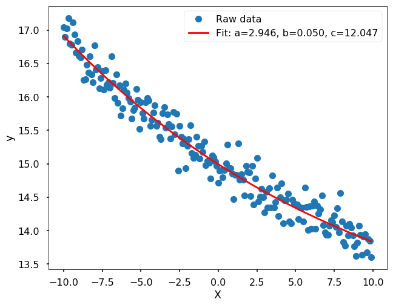
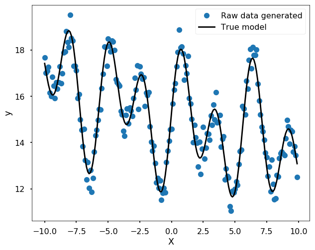
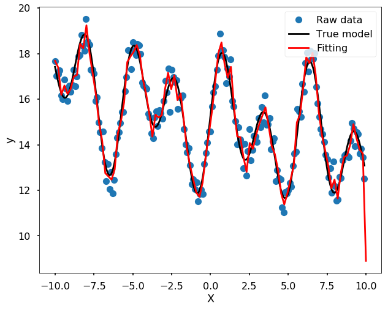
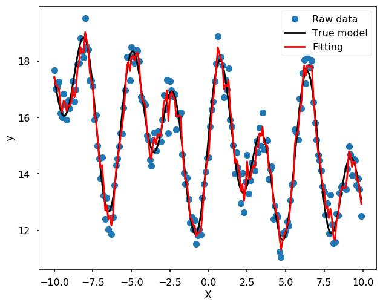
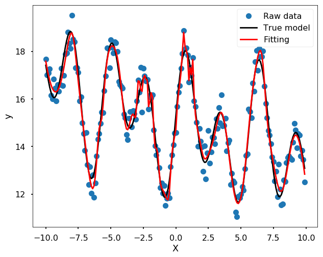

Recently I have a friend asking me how to fit a function to some observational data using python. Well, it depends on whether you have a function form in mind. If you have one, then it is easy to do that. But even you don't know the form of the function you want to fit, you can still do it fairly easy. Here are some examples. 


```python
import numpy as np
import matplotlib.pyplot as plt

%matplotlib inline

plt.style.use('seaborn-poster')
```

## If you can tell the function form from the data

For example, if I have the following data that actually generated from the function $3e^{-0.05x}+12$, but with some noise. When we see this dataset, we can tell it might be generated from a exponential function.


```python
np.random.seed(42)

x = np.arange(-10, 10, 0.1)

# true data generated by this function
y = 3 * np.exp(-0.05*x) + 12

# adding noise to the true data
y_noise = y + np.random.normal(0, 0.2, size = len(y))
```


```python
plt.figure(figsize = (10, 8))
plt.plot(x, y_noise, 'o', label = 'Raw data generated')
plt.xlabel('X')
plt.ylabel('y')
plt.legend()
plt.show()
```


Since we have the function form in mind already, let's fit the data using scipy function - [curve_fit](https://docs.scipy.org/doc/scipy/reference/generated/scipy.optimize.curve_fit.html)


```python
from scipy.optimize import curve_fit
```


```python
def func(x, a, b, c):
    return a * np.exp(-b * x) + c
```


```python
popt, pcov = curve_fit(func, x, y_noise)
```


```python
plt.figure(figsize = (10, 8))

plt.plot(x, y_noise, 'o',
    label='Raw data')

plt.plot(x, func(x, *popt), 'r',
    label='Fit: a=%5.3f, b=%5.3f, c=%5.3f' % tuple(popt))

plt.legend()

plt.xlabel('X')
plt.ylabel('y')

plt.show()
```





## More complicated case, you don't know the funciton form

For a more complicated case that we can not easily guess the form of the function, we could use a Spline to fit the data. For example, we could use [UnivariateSpline](https://docs.scipy.org/doc/scipy-0.19.0/reference/generated/scipy.interpolate.UnivariateSpline.html). 


```python
from scipy.interpolate import UnivariateSpline
```


```python
np.random.seed(42)

x = np.arange(-10, 10, 0.1)

# true data generated by this function
y = 3 * np.exp(-0.05*x) + 12 + 1.4 * np.sin(1.2*x) + 2.1 * np.sin(-2.2*x + 3)

# adding noise to the true data
y_noise = y + np.random.normal(0, 0.5, size = len(y))
```


```python
plt.figure(figsize = (10, 8))
plt.plot(x, y_noise, 'o', label = 'Raw data generated')
plt.plot(x, y, 'k', label = 'True model')
plt.xlabel('X')
plt.ylabel('y')
plt.legend()
plt.show()
```





```python
# Note, you need play with the s - smoothing factor
s = UnivariateSpline(x, y_noise, s=15)
xs = np.linspace(-10, 10, 100)
ys = s(xs)
```


```python
plt.figure(figsize = (10, 8))
plt.plot(x, y_noise, 'o', label = 'Raw data')
plt.plot(x, y, 'k', label = 'True model')
plt.plot(xs, ys, 'r', label = 'Fitting')
plt.xlabel('X')
plt.ylabel('y')
plt.legend(loc = 1)
plt.show()
```





## Of course, you could also use Machine Learning algorithms

Many machine learning algorithms could do the job as well, you could treat this as a regression problem in machine learning, and train some model to fit the data well. I will show you two methods here - Random forest and ANN. I didn't do any test here, it is only fitting the data and use my sense to choose the parameters to avoid the model too flexible. 

#### Use Random Forest


```python
from sklearn.ensemble import RandomForestRegressor
from sklearn.metrics import mean_squared_error
```


```python
# fit the model and get the estimation for each data points
yfit = RandomForestRegressor(50, random_state=42).fit(x[:, None], y_noise).predict(x[:, None])

plt.figure(figsize = (10,8))
plt.plot(x, y_noise, 'o', label = 'Raw data')
plt.plot(x, y, 'k', label = 'True model')
plt.plot(x, yfit, '-r', label = 'Fitting', zorder = 10)
plt.legend()
plt.xlabel('X')
plt.ylabel('y')

plt.show()
```





#### Use ANN


```python
from sklearn.neural_network import MLPRegressor
```


```python
mlp = MLPRegressor(hidden_layer_sizes=(100,100,100), max_iter = 5000, solver='lbfgs', \
                   alpha=0.01, activation = 'tanh', random_state = 8)

yfit = mlp.fit(x[:, None], y_noise).predict(x[:, None])

plt.figure(figsize = (10,8))
plt.plot(x, y_noise, 'o', label = 'Raw data')
plt.plot(x, y, 'k', label = 'True model')
plt.plot(x, yfit, '-r', label = 'Fitting', zorder = 10)
plt.legend()

plt.xlabel('X')
plt.ylabel('y')

plt.show()
```




