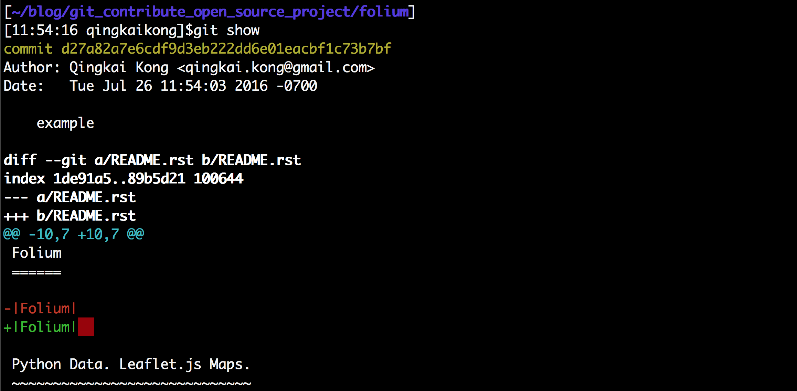

# git workflow to contribute open source project

[Github](https://github.com/) is a nice version control tool to work with, but how to use it collaborately with others, or contribute to some open source project has a steep learning curve, here, I will summary the main steps how you can contribute to a project.     

There are many ways you can work on a forked repo, i.e. you can either clone it to a virtual environment, or copy it directly to you machine and add it to your path. I like clone the repo directly to my mac

Follow the following steps:

### (1) Fork the project on the github website  
Press the button on the upper right corner (circled by the red), then you will have this repo in your account, it is more like copy it to your collection, so that you can mess with it.   

 

### (2) git clone the forked repo to your machine  
Note that, we clone the repo from your forked version, this will copy the repo from your 

```bash
$ git clone https://github.com/qingkaikong/folium.git
$ cd folium
$ git remote -v
```  
   

### (3) Install the package and dependencies  
I usually install the proejct using pip, and work with the modifications inside this folder. (You can also add it to your path). Note: You also need install the dependencies manually. 

```bash
$ cd path_to_folium/folium
$ pip install -e .
```  


### (4) add the upstream repo, this will let you to sync with the latest update   

```bash
$ git remote add upstream https://github.com/python-visualization/folium.git
$ git remote -v
``` 
 

### (5) Work on a new branch  
Never work on the master branch, but a new branch related with the problem. The reason we work on a new branch will be shown later.  

```bash
$ git checkout -b fix_some_problem
$ git branch
```
  

### (6) Finish the modification, add and commit  
After you finish the modification, you can add the changes, and commit it.   

```bash
$ git add Some_changes
$ git commit -m 'add changes XXX'
```  

### (7) Sync with the upstream master before you push   
Since other people may also work on this project, and merged some new things into the upstream master already, therefore, you need sync with the upstream master before push to avoid conflict. 

```bash
# this will get all the latest updates from the upstream repo
$ git remote update
# let's rebase to apply these latest updates to our repo
$ git pull --rebase upstream master
```
 

### (8) Push to your remote repo and create a Pull Request  


## Some notes before create a PR
### Check your code before you create a PR  
It is good practice to remove all the unnecessary spaces in your code, you can do this using git show, and the red boxes indicate that you introduced unnecessary spaces that you need delete them. 

```bash 
# after you commit, you can check with git show
$ git show
``` 
	 
### Squash your commit  
Now we see this red boxes that we want to remove it. But you don't want to commit one more time with 'remove unnecessary spaces', since the commit is to show a history of important changes. So the best way to do it is to squash the commit you will make, to do this:

```bash 
# after you commit, you can check with git show
$ vi README.rst
$ git add README.rst
$ git commit -m 'abc'
$ # show the log history
$ git log
$ 
```  
The reason we commit with 'abc' is because we will later squash this commit into the previous one, so you can call it anything. 
  
We can see the following log with the remove spaces fix - 'abc', so we want to squash it to the previous commit - 'add an example - how to contribute'. 
  

```bash 
# Let's squash the last two commits
$ git rebase -i 6bb2d90052b3f36bf449155bf2b0f938cbecb78e

``` 
 
The options are clear, we can either choose 's' to squash, and then delete the 2nd commit, or just fix it using 'f', which ignore the 2nd commit. Let's change this in the editor, and close the editor. 


View after you close the editor:


Now if you check git log again:


