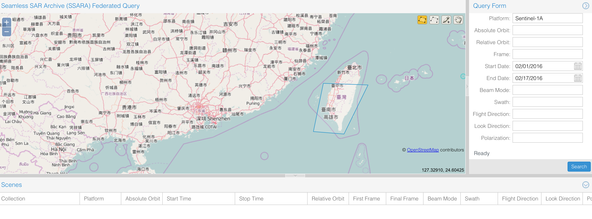
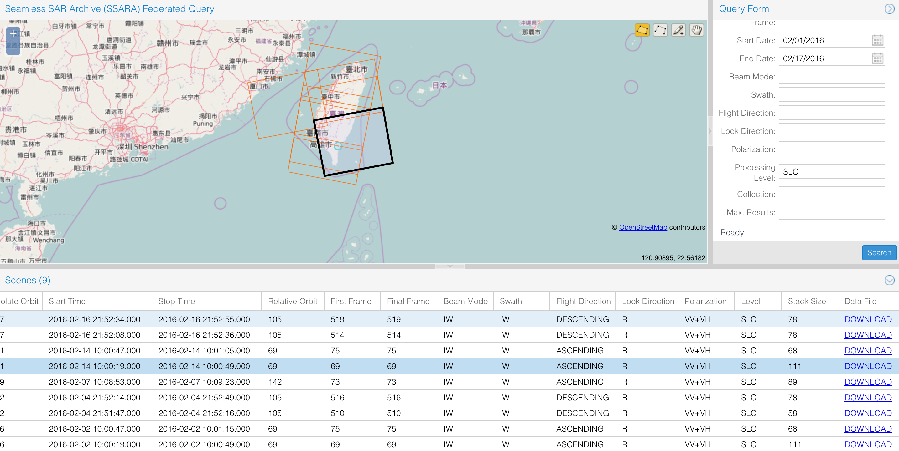

I learned processing [InSAR](https://en.wikipedia.org/wiki/Interferometric_synthetic_aperture_radar) data in the [shortcourse](https://www.unavco.org/education/advancing-geodetic-skills/short-courses/2016/insar-gmtsar/insar-gmtsar.html) at [Scripps](https://scripps.ucsd.edu/) using the [GMTSAR](http://topex.ucsd.edu/gmtsar/). In this blog, I will write down the steps I uesed to process the [Sentinel-1A](https://en.wikipedia.org/wiki/Sentinel-1A) data for my own reference. I will use the [2016 Taiwan M6.4 Meinong earthquake](https://en.wikipedia.org/wiki/2016_Taiwan_earthquake) as an example.      

**Step 1 - get data**   
There are multiple ways to get the data. The most common way is to use the [GUI](http://web-services.unavco.org/brokered/ssara/gui) or use the [API](https://github.com/bakerunavco/SSARA) directly. For this earthquake, we will try to use the GUI to download the Sentinel-1A data. We first draw a polygon around the earthquake regiion as shown in the following figure. Since the earthquake occured on Feb 5th, we put our search range from Feb 1 - Feb 17. Because we only use the SLC processing level, so I changed the 'Processing Level' to 'SLC'.  
  
After you pressed the search button, you will get a list of available data within the range, shown below. When you select any of the record, it will highlight on the map as the black box. Scoll to the right, you will see the download button two download the data. Because we want to download the data that can reflect the deformation caused by the earthquake, therefore, we need both the data before the earthquake, and after. By looking at the Ascending path, we have Feb 2nd and Feb 14th satisfy the requirement (Note: You should choose both from the same path, either Ascedning or Descending). Then go ahead to download the data (about 10 Gb).     
   
**Step 2 - get the orbit data**  
You also need the orbits data before processing, which you can download it [here](https://www.unavco.org/data/imaging/sar/lts1/winsar/s1qc/aux_poeorb/). The naming of the orbits data is like

``` 
S1A_OPER_AUX_POEORB_OPOD_20160222T121629_V20160201T225943_20160203T005943.EOF
```  
Note there are 3 dates, the first one indicate when it is processed (mostly useless in our example), and the last two dates are the start and end dates of the orbits, and we need make sure our Sentinel data date is within this range. For our case, we need the following two files:  

```
S1A_OPER_AUX_POEORB_OPOD_20160222T121629_V20160201T225943_20160203T005943.EOF  
S1A_OPER_AUX_POEORB_OPOD_20160305T121418_V20160213T225943_20160215T005943.EOF
```  
**Step 3 - folder structure**  
The next step you need is to put the data into a folder structure for processing. The folder structure looks like the following, and the red color indicate directories. The two .SAFE directories are from the InSAR data you downloaded. And the two files ending with eof.txt are the orbits data we downloaded. For the dem.grd, you can download it from [here](http://topex.ucsd.edu/gmtsar/demgen/) by specify the latitude and longitude. 
 
<pre>
Taiwan_earthquake
├── 01_run_prep.sh
├── 02_run_proc.sh
├── config.s1a.txt
├── <font color="red">orbits</font>
|   ├── <font color="red">S1A_IW_SLC__1SDV_20160202T100019_20160202T100049_009766_00E469_C190.SAFE</font>
|   ├── <font color="red">S1A_IW_SLC__1SDV_20160214T100019_20160214T100049_009941_00E981_ABD9.SAFE</font>
|   ├── S1A_OPER_AUX_POEORB_OPOD_20160222T121629_V20160201T225943_20160203T005943.eof.txt
|   └── S1A_OPER_AUX_POEORB_OPOD_20160305T121418_V20160213T225943_20160215T005943.eof.txt
└── <font color="red">topo</font>
    └── dem.grd
</pre>

```
Taiwan_earthquake
├── _config.yml
├── orbits
|   ├── begin-with-the-crazy-ideas.textile
|   └── on-simplicity-in-technology.markdown
├── topo
|   ├── footer.html
|   └── header.html
├── _layouts
|   ├── default.html
|   └── post.html
├── _posts
|   ├── 2007-10-29-why-every-programmer-should-play-nethack.textile
|   └── 2009-04-26-barcamp-boston-4-roundup.textile
├── _data
|   └── members.yml
├── _site
├── .jekyll-metadata
└── index.html
 
```